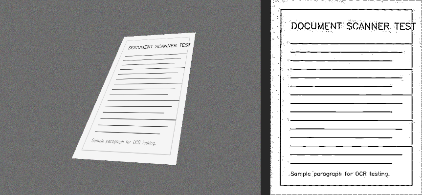

# EdgeVision - Document Scanner

A production-quality desktop application that automatically detects, extracts, rectifies, and enhances documents from photographs taken under challenging real-world conditions.

Built entirely in Python using classical computer vision (OpenCV) and PySide6.



---

## Features

### Core Scanning (unchanged)
- **Robust detection** — Canny → morphological closing → contours → Douglas–Peucker quadrilateral selection
- **Perspective correction** — Homography-based flat, top-down output
- **Enhancement modes** — Adaptive thresholding, Otsu thresholding, or no enhancement
- **Export formats** — PNG, JPG, and single-page PDF

### EdgeVision UI
- **EdgeVision branding** — Clean header with application identity
- **Real-time processing** — Canny, morph, and enhancement controls update results automatically (400 ms debounce)
- **Interactive sliders** — Live parameter controls with current value display
- **Enhancement comparison** — Drag the handle to compare **perspective-corrected** vs **enhanced** output
- **Detection overlay** — Toggle contour and corner visualization in the pipeline viewer
- **Pipeline inspector** — Original → Grayscale → Edge Detection → Morphology → Contour Detection → Perspective Corrected → Final Enhanced Scan
- **Dark modern theme** — Polished layout for portfolio and demo use

### Performance
- **Background worker threads** — GUI stays responsive during processing
- **Smart preview mode** — Fast preview processing; full resolution on export
- **Processing cache** — Grayscale/blur cached until image or preprocessing options change
- **Multi-strategy detection** — Fallback to adaptive threshold and largest-rectangle search
- **cornerSubPix refinement** — Optional sub-pixel corner accuracy before warping
- **Optional preprocessing** — CLAHE, bilateral filtering, shadow reduction
- **Live metrics** — Processing time and input/output resolution

---

## Installation

### Prerequisites

- Python 3.10 or newer
- macOS, Windows, or Linux

### Setup

```bash
cd document_scanner
python -m venv venv
source venv/bin/activate        # Windows: venv\Scripts\activate
pip install -r requirements.txt
```

Or use the install script (uses the smaller PySide6 Essentials package):

```bash
chmod +x scripts/install_dependencies.sh
./scripts/install_dependencies.sh
```

### Generate Test Images (optional)

```bash
python scripts/generate_examples.py
```

### Run the Application

```bash
python main.py
```

### Run Benchmarks

```bash
python scripts/benchmark.py
```

### Verify Parameter Wiring

```bash
python scripts/validate_parameters.py
```

See [PARAMETER_VALIDATION.md](PARAMETER_VALIDATION.md) for the full GUI → OpenCV connection checklist. Every scan logs active parameter values to the console.

---

## Dependencies

| Package | Purpose |
|---------|---------|
| opencv-python | Image processing, Canny, contours, perspective transform |
| numpy | Array operations |
| Pillow | Fallback image loading |
| PySide6 | Desktop GUI |
| img2pdf | Single-page PDF export |

---

## Usage Guide

1. **Launch** the application with `python main.py`.
2. Click **Upload Image** and select a JPG, JPEG, PNG, or BMP file.
3. The scan runs automatically — adjust **sliders** and watch results update in real time.
4. Use the **Compare** tab — drag the handle to compare the rectified document (left) with the enhanced scan (right).
5. Open the **Pipeline** tab to inspect every stage of the pipeline.
6. Enable **Show Detection Overlay** to visualize corners and boundaries on the contour tab.
7. Check **Export Original Resolution** before saving for full-quality output.
8. Click **Save Result** to export as PNG, JPG, or PDF.

### Tips for Best Results

- Ensure document edges are visible against the background.
- Avoid extreme motion blur; mild blur is handled.
- For low-contrast images, lower the Canny lower threshold (e.g., 50).
- For noisy images, increase the morphological kernel size (e.g., 7).

---

## Pipeline Explanation

```
Input Image
    │
    ▼
[1] Load (preserve resolution)
    │
    ▼
[2] Preprocess — Grayscale + Gaussian Blur (5×5)
    │
    ▼
[3] Canny Edge Detection (configurable thresholds)
    │
    ▼
[4] Morphological Closing — connect broken edges
    │
    ▼
[5] Contour Detection — RETR_LIST, CHAIN_APPROX_SIMPLE
    │
    ▼
[6] Douglas–Peucker Approximation — select largest 4-vertex quad
    ▼
[7] Perspective Transform — rectified document
    │                         └── Compare tab (left side)
    ▼
[8] Enhancement — Adaptive or Otsu thresholding
    │              └── Compare tab (right side)
    ▼
Scanned Output
```

The **Compare** tab shows rectified vs enhanced — exactly what the enhancement stage changes.

### Why Douglas–Peucker over Convex Hull?

Convex Hull ignores concavities and can include background clutter. Douglas–Peucker (`cv2.approxPolyDP`) better approximates rectangular document boundaries and is the standard approach in document scanning applications.

---

## Project Structure

```
document_scanner/
├── main.py
├── gui/
│   ├── main_window.py
│   ├── widgets.py
│   ├── comparison_widget.py
│   ├── labeled_slider.py
│   ├── pipeline_viewer.py
│   ├── header.py
│   └── theme.py
├── scanner/
│   ├── preprocessing.py
│   ├── edge_detection.py
│   ├── contour_detection.py
│   ├── corner_refinement.py
│   ├── perspective.py
│   ├── enhancement.py
│   └── pipeline.py
├── utils/
│   ├── image_utils.py
│   └── pdf_export.py
├── scripts/
│   ├── generate_examples.py
│   └── benchmark.py
├── assets/
├── examples/
├── requirements.txt
├── README.md
└── TECHNICAL_REPORT.md
```

---

## Example Outputs

Sample outputs are included in `examples/outputs/`:

| Input | Output |
|-------|--------|
| `examples/02_angle_25.jpg` | `examples/outputs/02_angle_25_scanned.png` |
| Detection overlay | `examples/outputs/02_angle_25_detection.png` |

Regenerate with:

```bash
python scripts/create_sample_outputs.py
```

Benchmark JSON is written to `benchmark_results.json` after running `python scripts/benchmark.py`.

---

## Benchmark Summary

Run `python scripts/benchmark.py` after generating examples. Typical results on synthetic test images:

| Metric | Typical Value |
|--------|---------------|
| Detection success rate | ~90–100% |
| Perspective correction rate | ~90–100% |
| Average processing time | 0.05–0.3s per image (CPU) |

See `TECHNICAL_REPORT.md` Section 6 for detailed per-image results.

---

## Packaging with PyInstaller

Create a standalone executable:

```bash
pip install pyinstaller

# macOS / Linux
pyinstaller --name DocumentScanner \
  --windowed \
  --add-data "assets:assets" \
  main.py

# Windows (use semicolon separator)
pyinstaller --name DocumentScanner ^
  --windowed ^
  --add-data "assets;assets" ^
  main.py
```

The executable appears in `dist/DocumentScanner/`.

### Notes

- On macOS, you may need `--osx-bundle-identifier com.documentscanner.app`
- Test the built app with images from `examples/`
- If OpenCV fails to load, add `--hidden-import=cv2`


